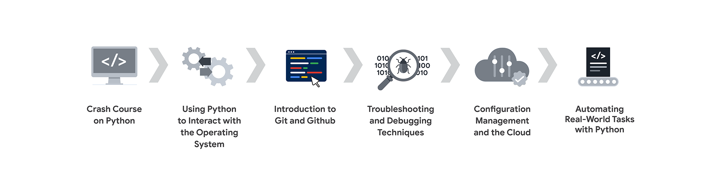

##### **Certification path:**

[Crash Course on Python](https://www.coursera.org/learn/python-crash-course/home/welcome)
 

[Using Python to Interact with the Operating System](https://www.coursera.org/learn/python-operating-system/home/welcome)
 

[Introduction to Git and GitHub (this course)](https://www.coursera.org/learn/introduction-git-github/lecture/BP2ar/course-introduction)

[Troubleshooting and Debugging Techniques](https://www.coursera.org/learn/troubleshooting-debugging-techniques/home/welcome)

[Configuration Management and the Cloud](https://www.coursera.org/learn/configuration-management-cloud/home/welcome)

[Automating Real-World Tasks with Python](https://www.coursera.org/learn/automating-real-world-tasks-python/home/welcome)

=====================================================

##### **Git resources:**
[Pro Git](https://git-scm.com/book/en/v2)
: This book (available online and in print) covers all the fundamentals of 
how Git works and how to use it.

[Git tutorial](https://git-scm.com/docs/gittutorial)
: This tutorial includes a very brief reference of all Git commands available. 
You can use it to quickly review the commands that you need to use