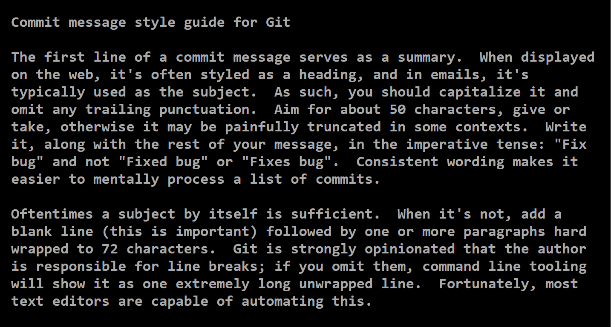

### Guidelines for writing commit messages

A commit message is generally broken into two sections: 
-  a short summary and 
-  a description of the changes. 
When the git commit command is run, Git will open a text editor to write your commit message. 
A good commit message includes the following:

##### Summary: 

- The first line contains the summary, formatted as a header, containing 50 characters or fewer.

##### Description: 

- The description is usually kept under 72 characters and provides detailed information about
   the change. It can include references to bugs or issues that will be fixed with the change. 
   It also can include links to more information when relevant. 

Click the link to review an example of a commit message: 
https://commit.style/ :

 