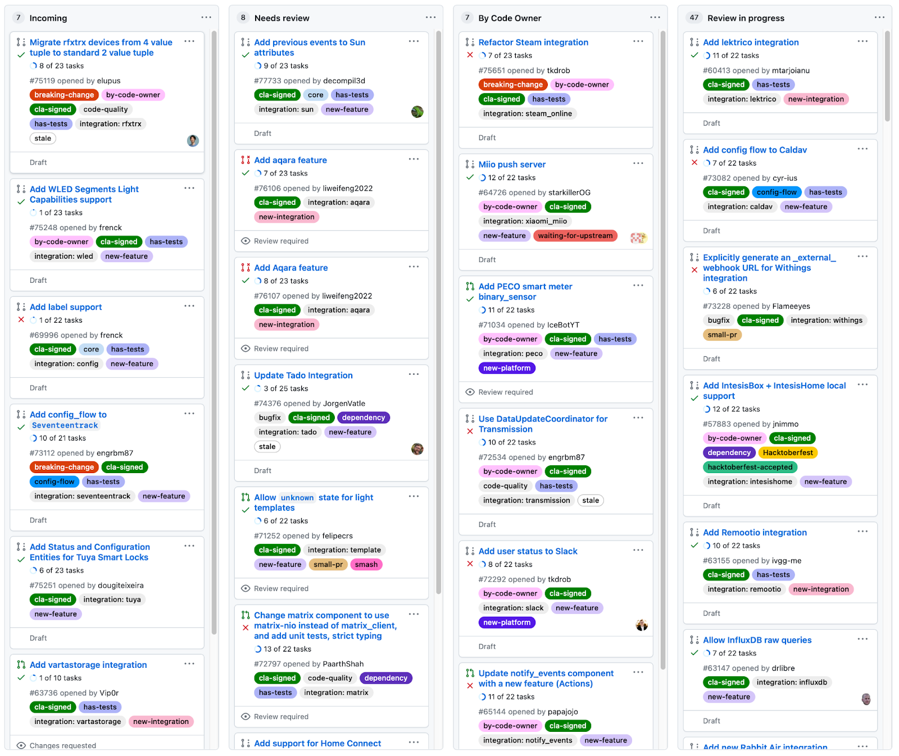
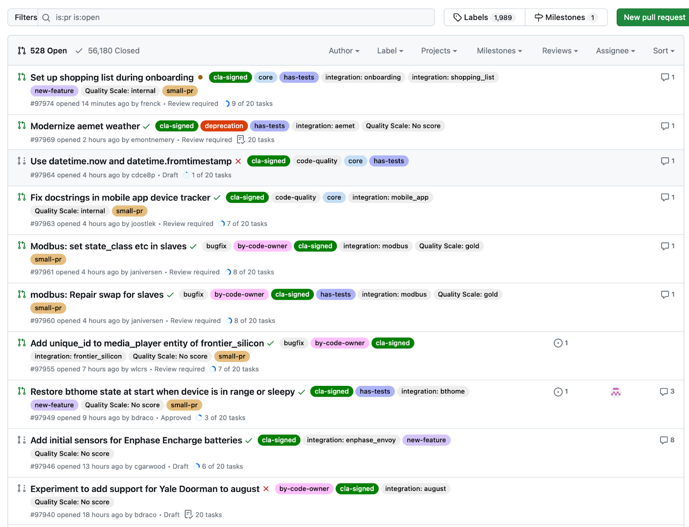
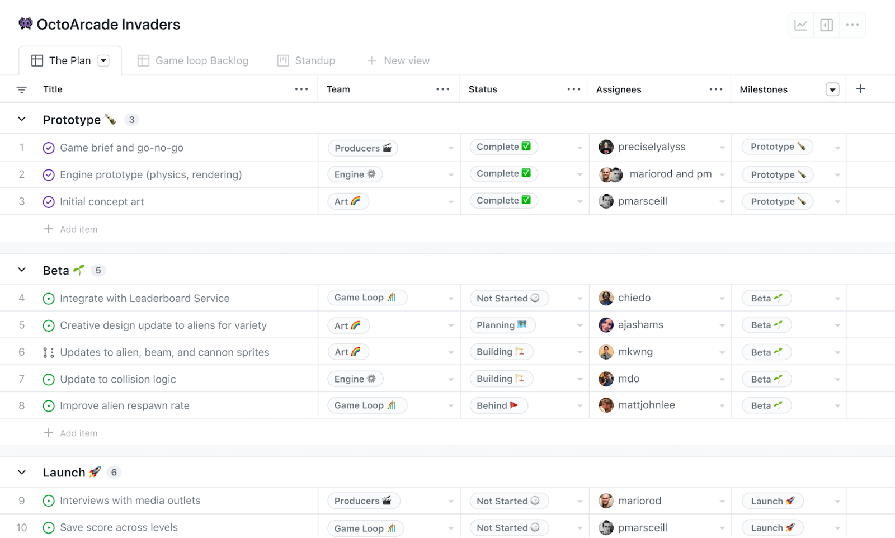

Besides serving as a repository for your code and tracking changes to your code over time, GitHub also includes tools to help manage your software project.

#### GitHub Projects

GitHub offers multiple tools to manage and plan your work. For example, GitHub Projects is a flexible tool for tracking and managing work on GitHub. You can use Projects to create an adaptable spreadsheet, task-board, and road map which integrates with your issues and pull requests. With GitHub projects, you can filter, sort, and group your issues and pull requests and customize to fit your team’s workflow. Projects can be created in a repository, and then issues can be added to them.

GitHub Project task board with categories: incoming, needs review, by code owner, and review in progress.

#### GitHub Issues

GitHub Issues is a part of GitHub Projects, and it provides a way to track tasks that you need to complete. An issue can be a bug, a feature request, or a housekeeping task (like upgrading a library to the latest version). Issues can have extensive text and descriptions attached to them, including screenshots and snippets of code. Issues can be discussed, commented on, assigned to people, and tagged.

Here’s a screenshot of the top open issues for a very active Python application on GitHub:

As issues are worked, and pull requests linked to those issues are completed, Issues will automatically move into the next column, and then the next, until they’re closed. You can also drag issues to another column, and GitHub will update the status (and possibly assignee and other fields) to match.

#### Traditional project management

You can also view open issues in a more traditional project management format, with status, assignees, estimates, and more:

GitHub also supports extensive automation. You can define workflows that update issues or projects automatically as issues change or comments are added. 

#### Resources for more information:

[A Quick Guide to Using GitHub for Project Management](https://www.jobsity.com/blog/a-quick-guide-to-using-github-for-project-management)

This article provides a brief overview of project management tools on GitHub.

[GitHub for project management](https://openscapes.github.io/series/core-lessons/github/github-issues.html)

This lesson offers detailed descriptions of GitHub’s project management tools.

[Using GitHub as your Project Management Tool](https://www.youtube.com/watch?v=qgQAFP6oSKw)
 

This video provides examples on GitHub  project management tools.

[GitHub Issues: Project Planning for Developers](https://github.com/features/issues)
 

This GitHub page shows the many project management tools available for developers.

