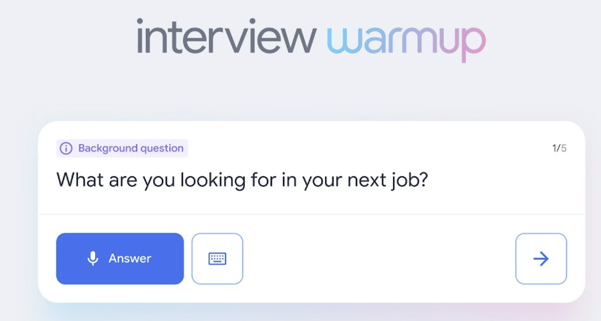

Interview Warmup

Now that you have the skills and knowledge to work in e-commerce and digital marketing, it’s time to start preparing for interviews. 
[Interview Warmup](http://grow.google/certificates/interview-warmup)
 is a tool that helps you practice answering questions to get more confident and comfortable with interviewing.

Get started
Follow these steps to start a 5-question practice interview related to e-commerce and digital marketing:

Go to grow.google/interview-warmup.

Click Start practicing.

Select the “General” practice set.

Click Start.

It takes about 10 minutes, and the questions will be different every time. Each question set will have two background questions, one behavioral question, and two technical questions, simulating what you would encounter in a real interview. You can try as many practice interviews as you want.

You’ll also have the option to access the full list of interview questions if you’d like to review more of the questions available or focus on specific topics.

How it works
Interview Warmup asks interview questions for you to practice answering out loud. It transcribes your answer in real time so you can review what you said. You’ll also review insights, which are patterns detected by machine learning that can help you discover things about your answers and identify ways to keep improving.

Here are a few examples of questions the tool might ask:

Can you please tell me a bit about yourself?

What are you looking for in your next job?

Describe a situation when you disagreed with someone at work. What did you do, and what was the result?

What are your career goals for the next five years?

Please share a time when you set a goal for yourself and achieved it. How did you go about that?

Tell me about a time when you had to develop a new skill. How did you approach the learning process?

Tell me about a time you made a mistake. How did you communicate that mistake?

Here are some of the insights that Interview Warmup provides:

Talking points: The tool lets you know which topics you covered in your answer, such as your experience, skills, and goals. You’ll also be able to view other topics that you might want to consider covering.

Most-used words: The tool highlights the words you used most often and suggests synonyms to broaden your word choices.

Job-related terms: The tool highlights the words you used that are related to the role or industry in which you are preparing to work. You’ll also be able to view an entire list of job-related terms that you might want to consider including in your answer.

Interview Warmup gives you the space to practice and prepare for interviews on your own. Your responses will be visible only to you, and they won’t be graded or judged.

Key takeaways
Practicing for interviews is an important skill for your career in IT Automation. Using Interview Warmup can help you practice interview questions and receive feedback in real time. As you practice, you will gain confidence and be able to prepare more polished responses for common interview questions.

