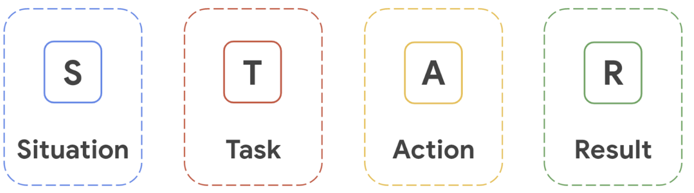

Answer Questions with the STAR Method
The STAR method is a technique for answering interview questions. Responses are structured to describe:

Situation: Give a brief description of a situation in which you excelled.

Task: Explain the goal of the situation.

Action: Describe the specific action(s) you took in the situation.  

Result: Tell about the positive results of your actions.

Your STAR responses should focus on your involvement in the situation. Avoid describing the actions and results achieved by someone else. 

Activity Overview
In this activity, you will answer two common behavioral interview questions using the STAR method. 

In an interview, you may be asked behavioral interview questions. These types of questions require you to share a time when you were faced with a particular situation or had to practice a certain skill. The STAR method is a helpful strategy for answering behavioral interview questions in a clear, organized, and engaging way. As you’ve learned, STAR stands for “situation,” “task,” “action,” and “result.” 

Scenario
Review the scenario below. Then complete the step-by-step instructions.

Using the STAR method to answer behavioral interview questions gives interviewers a sense of who you are and why you’ve applied for the role. This method can make your responses easy to follow by providing a logical structure to each story you share. Preparing and practicing responses using the STAR method in advance can also help you feel more confident going into an interview. 

In this activity, you will prepare responses to two common behavioral interview questions: 

First, you will recall and record notes about experiences you’ve had in the past that demonstrate your key skills. 

Then, you will select two questions from a list of frequently-asked behavioral questions in IT support interviews. You will answer each of these questions using the STAR method. 

Optionally, you can practice answering these questions and others aloud in front of a mirror, friend, or family member. 

Step-By-Step Instructions
Step 1: Access the template
To use the template for this course item, click the link below and select “Use Template.” 

Link to template:
 
[STAR responses](https://docs.google.com/document/d/1R-e6Dgicl6cV-d6YSbxQVSuzpo-NEPHH4eB2mKMN_38/template/preview?usp=sharing)

OR

If you don’t have a Google account, you can download the Microsoft Word template from the attachment below.

Step 2: Identify experiences that demonstrate your skills
Research the most common Python automation related skills that companies are looking for by reviewing job descriptions on platforms like 
[Indeed](https://www.indeed.com/)
, 
[LinkedIn Job Search](https://www.linkedin.com/jobs/)
, or 
[CareerBuilder](https://www.careerbuilder.com/)
. Then, consider the experiences you’ve had that demonstrate those types of skills. These may be past work experiences, school projects, volunteer positions, or any other relevant activities you’ve done—even the completion of this program. 

Add notes on at least three of those experiences to the Experiences that demonstrate my skills section of the STAR responses template. 

Step 3: Select interview questions
During a job interview, you may be asked behavioral interview questions. Your answers to these questions should demonstrate how you handled a specific situation in the past and indicate how you might handle a similar situation in the future. 

Review the list of Common Behavioral Interview Questions for IT Professionals on the second page of the 
[STAR responses](https://docs.google.com/document/d/1R-e6Dgicl6cV-d6YSbxQVSuzpo-NEPHH4eB2mKMN_38/template/preview?usp=sharing)
 template. Consider which questions would allow you to describe the experiences you recorded in Step 2. Then, select two of the questions to answer, copy them, and paste them in the Question 1 and Question 2 sections of the template.

Step 4: Describe the situation
Using the STAR method helps organize your responses following a story-like structure. To review, STAR stands for “situation,” “task,” “action,” and “result.”

Begin by describing a particular situation, challenge, or event you experienced. First, review Question 1 and the experiences you added to the STAR responses template. Select an experience you had that relates to the question. Then, in the Situation section, add 2–3 sentences describing the situation. Be as specific as possible, providing enough detail to help the interviewer understand the context in which the situation took place. 

Step 5: Describe your task
Next, relate that situation to a task that you were required to complete. 

In the Task section, add 1–2 sentences describing what you were asked to do, how you were involved, or what you were responsible for in the situation. Explain exactly how you fit into the story you’re telling.

Step 6: Explain the actions you took
Now that you’ve given the interviewer a sense of what your role was, explain the action you took to meet the challenge or solve the problem. 

In the Action section, add 2–4 sentences describing the action or actions you took to accomplish the task. Give specific details that demonstrate your abilities and skills. This part of your response may take the most time to cover, as you can highlight multiple skills here.  

Step 7: Share your results
Finally, share the results that you achieved. 

In the Results section, add 2–4 sentences discussing the outcome of the actions you took and the impact you had. Where possible, use data—such as numbers and percentages—to reinforce your response. If you’re sharing an experience that came with challenges, you may also want to share the lessons you learned. 

Step 8: Answer the second question
Repeat steps 4–7 to answer Question 2 using the STAR method.

(Optional) Step 9: Practice your responses aloud
To prepare yourself to answer these types of questions verbally, practice your answers out loud in front of a mirror or with a friend or family member. Try answering additional questions from the list of Common Behavioral Interview Questions for IT Professionals (on the second page of the 
[STAR responses](https://docs.google.com/document/d/1R-e6Dgicl6cV-d6YSbxQVSuzpo-NEPHH4eB2mKMN_38/template/preview?usp=sharing)
 template) in the same manner. 

Finally, be sure to save a blank copy of the 
[STAR responses](https://docs.google.com/document/d/1R-e6Dgicl6cV-d6YSbxQVSuzpo-NEPHH4eB2mKMN_38/template/preview?usp=sharing)
 template you used to complete this activity. You can use it for further practice or in your professional projects. This template will help you work through your thought processes and demonstrate your experience to potential employers.

What to Include in Your Response
Be sure to address the following criteria in your completed STAR responses:

A description of three experiences that showcase your skills

A selection of two interview questions to answer

A description of the following as it relates to each question:

A situation you experienced (2–3 sentences)

The task you were asked to complete or your responsibility in the situation (1–2 sentences)

The actions you took to meet the challenge or solve the problem (2–4 sentences)

The result of your actions (2–4 sentences)

